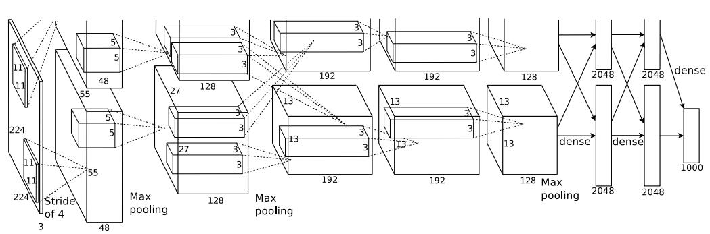
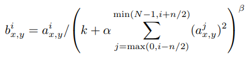

* 1、网络结构
* 2、训练技巧
* 3、代码说明

> 参考文档：https://papers.nips.cc/paper/4824-imagenet-classification-with-deep-convolutional-neural-networks.pdf

## 网络结构

alexnet总共有8层，其中前5层为convolution layer，后3层为full connected layer。

### 卷积层

1. conv1的输入图像为227\*227\*3，使用了96个卷积核，size为(96, 11, 11, 3)，卷积核沿x轴，y轴方向移动，步长为4；卷积后输出大小为55\*55\*96(其中55=227-11/4+1)，然后使用LRN(Local Response Normalized)归一化，再进行pool_size=(3, 3)，stride=2的max-pooling，最后使用relu激活函数，输出为27\*27*96；
2. conv2的输入大小为两个27\*27\*48(因为使用了两个GPU)，使用256个卷积核(单个gpu为128个，size为(128, 5, 5, 48))，卷积前做(2, 2)的padding，stride为1，产生27\*27*256的输出，之后进行LRN处理，再进行pool_size=(3, 3)和stride=2的max-pooling，使用relu激活后，输出为13\*13\*256；
3. conv3, 4都没有LRN和pooling，conv5只有pooling，其中conv3使用了384个卷积核(384\*3\*3\*256)，padding为(1, 1)，stride=1，输出为13\*13\*384；conv4如conv3，最终输出仍为13\*13\*384；
4. conv5的输入数据，为conv4输出的2组13\*13\*192，首先padding(1，1)，然后每组的卷积核为(128\*\3\*3\*192)，stride=1，所以每组的输出为13\*13\*128。卷积之后使用relu激活，再进行kernel_size=(3, 3)，stride=2的max_pooling，如此(13-3)/2+1=6，即pooling结束后，各组大小为6\*6\*128。

### 全连接层

1. fc6输出的神经元个数为4096，所以该全连接层的weights大小是(6\*6\*256, 4096)，激活函数为relu，并使用dropout后输出到下一层；
2. fc7输出的神经元个数为4096，所以该全连接层的weights大小是(4096，4096)，同样激活函数为relu，并使用dropout后输出；
3. fc8是最后的全连接层，由于应用于imagenet，该数据集共1000个类别，所以该层的weights大小是(4096，1000)。

### alexnet网络结构图



## 训练技巧

alexnet作为首次应用神经网络于imagenet竞赛中，提出了一系列改进神经网络效果的方法。

1. 使用非线性激活函数Relu

   以往使用饱和的tanh或sigmoid激活函数时，在使用梯度下降方法训练容易造成梯度消失问题，降低训练速度；使用非饱和的Relu则可以避免这个问题；

2. 使用多GPU并行训练

3. 对Relu激活后的输出，使用局部响应标准化(LRN)

   

   其中，使用了同一(x, y)下相邻通道的a进行归一化。

4. 使用了重叠池化，即步长小于池化kernel大小时，同一像素点参与了多次pooling。

5. 使用随机失活dropout，有利于减少过拟合。

## 代码实现

这里贴一个使用tflearn实现的alexnet实例，主要用于回顾前面逐层介绍的网络结果。

```python
from __future__ import division, print_function, absolute_import

import tflearn
from tflearn.layers.core import input_data, dropout, fully_connected
from tflearn.layers.conv import conv_2d, max_pool_2d
from tflearn.layers.normalization import local_response_normalization
from tflearn.layers.estimator import regression

import tflearn.datasets.oxflower17 as oxflower17
X, Y = oxflower17.load_data(one_hot=True, resize_pics=(227, 227))

# Building 'AlexNet'
network = input_data(shape=[None, 227, 227, 3])
network = conv_2d(network, 96, 11, strides=4, activation='relu')
network = max_pool_2d(network, 3, strides=2)
network = local_response_normalization(network)
network = conv_2d(network, 256, 5, activation='relu')
network = max_pool_2d(network, 3, strides=2)
network = local_response_normalization(network)
network = conv_2d(network, 384, 3, activation='relu')
network = conv_2d(network, 384, 3, activation='relu')
network = conv_2d(network, 256, 3, activation='relu')
network = max_pool_2d(network, 3, strides=2)
network = local_response_normalization(network)
network = fully_connected(network, 4096, activation='relu')
network = dropout(network, 0.5)
network = fully_connected(network, 4096, activation='relu')
network = dropout(network, 0.5)
network = fully_connected(network, 1000, activation='softmax')
network = regression(network, optimizer='momentum',
                     loss='categorical_crossentropy',
                     learning_rate=0.001)

# Training
model = tflearn.DNN(network, checkpoint_path='model_alexnet',
                    max_checkpoints=1, tensorboard_verbose=2)
model.fit(X, Y, n_epoch=1000, validation_set=0.1, shuffle=True,
          show_metric=True, batch_size=64, snapshot_step=200,
          snapshot_epoch=False, run_id='alexnet_oxflowers17')
```


